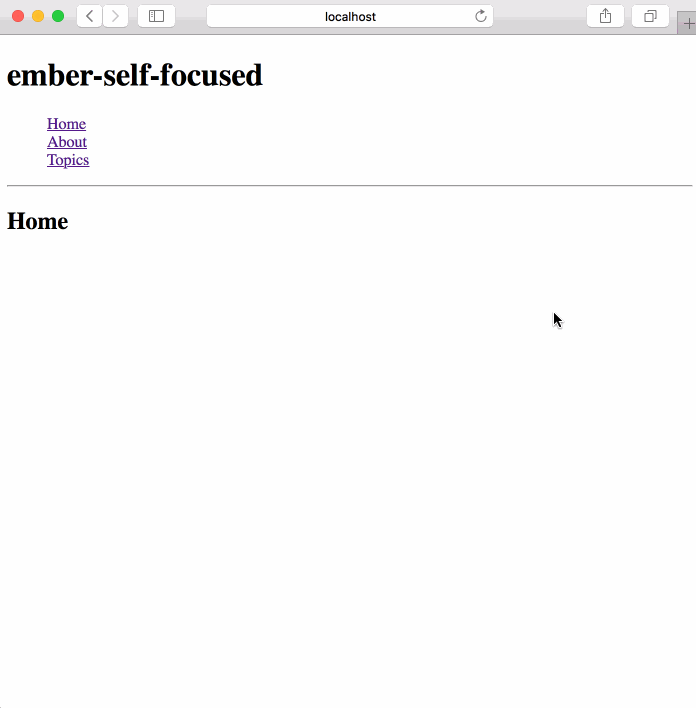

ember-self-focused
==============================================================================

Making Ember Applications’ UI Transitions Screen Reader Friendly.

When UI transitions happen in a SPA (or in any dynamic web application), there is visual feedback; however, for users of screen reading software, there is no spoken feedback by default. Traditionally, screen reading software automatically reads out the content of a web page during page load or page refresh. In single page applications, the UI transitions happen by rewriting the current page, rather than loading entirely new pages from a server; this makes it difficult for screen reading software users to be aware of UI changes (e.g., clicking on the navigation bar to load a new route).

If the corresponding HTML node of the dynamic content can be focused programmatically, screen reading software will start speaking the textual content of that node. Focusing the corresponding HTML node of the dynamic content can be considered guided focus management. Not only will it facilitate the announcement of the textual content of the focused HTML node, but it will also serve as a guided context switch. Any subsequent “tab” key press will focus the next focusable element within/after this context.
However, keeping track of the HTML nodes to be focused can be tedious, repetitive, and error-prone since there could be hundreds of nodes that need to be programmatically focused in a SPA.

For ember applications, this addon solves the problem.



Installation
------------------------------------------------------------------------------

```
ember install ember-self-focused
```

Usage
------------------------------------------------------------------------------

Add the `self-focused` component to all the desired templates/component corresponding to the routes.
```html
{{#self-focused}}
  <!-- html block to be yielded -->
{{/self-focused}}
```

Since the div will be focused, it will have a focus outline/highlight, if that is not desired, please add the following styles:

```css
.self-focused:focus {
  outline: none
}
```

If there are tests in the consuming application that is testing `div.self-focused` to be the `document.activeElement` as a result of `set`, please use `settled` like so:

```js
import { render, settled} from '@ember/test-helpers';
...

module('some module', function(hooks) {
  ...

  test('some test', async function(assert) {
    this.set('one', null);

    await render(hbs`
      <div id="container">
        {{#self-focused class="one" one=one}}
          template block text
        {{/self-focused}}
      </div>
    `);

    this.set('one', 'foo');
    await settled();
    let selfFocusedDiv = this.element.querySelector('#container .one');
    assert.equal(selfFocusedDiv.getAttribute('tabindex'), '-1', 'self-focused <div> one has a tabindex property with value -1');
  });
}
```

Implementation overview
------------------------------------------------------------------------------

- `self-focused` component on initial render invokes the `didInsertElement` and on re-render invokes the `didRenderElement` method of the `focus-manager` respectively passing the self HTML node as argument .
- `focus-manager` service carries out the functionality of focusing the desired node.
  - `focus-manager` utilizes two state variables, namely `_isFirstRender` and `_nodeToBeFocused`.
    - initial value of the `_isFirstRender` is set to `true`
    - initial value of the `_nodeToBeFocused` is set to `null`
  - `focus-manager` on initialization schedules `_isFirstRender` to be set to `false`in the `afterRender` queue.
  - `focus-manager` has two private methods namely `_setFocus` and `_removeTabIndex`.
    - `_setFocus` method
      - adds `tabindex=-1` to the `nodeToBeFocused`
      - invokes native `focus()` method on it
      - attaches `_removeTabIndex` method to the `_nodeToBeFocused` as the `click` and `blur` event handler
      - sets `_nodeToBeFocused` to `null`
    - `_removeTabIndex` method, removes the `tabindex`, `click` and `blur` event handlers from `nodeToBeFocused`
  - `focus-manager` service exposes two methods, namely `didInsertElement` and `didRenderElement`, which are consumed by `self-focused` component.
    - `didInsertElement` and `didRenderElement` both accept a HTML node as an argument.
    - `didInsertElement` and `didRenderElement` both bail out if `_isFirstRender` is true.
    - for `didInsertElement` the very last `self-focused` div passed to it for the render cycle wins
    - for `didRenderElement` the very first `self-focused` div passed to `didInsertElement` for the render cycle wins, if and only if `_nodeToBeFocused` was null when this method was invoked.
    - `didInsertElement` and `didRenderElement` both schedule the private `setFocus` method, in the `afterRender` queue after if `_nodeToBeFocused` was updated.

Contributing
------------------------------------------------------------------------------

### Running tests

* `ember test` – Runs the test suite on the current Ember version
* `ember test --server` – Runs the test suite in "watch mode"
* `ember try:each` – Runs the test suite against multiple Ember versions

### Running the dummy application

* `ember serve`
* Visit the dummy application at [http://localhost:4200](http://localhost:4200).

License
------------------------------------------------------------------------------

This project is licensed under the [BSD-2-Clause License](LICENSE).
